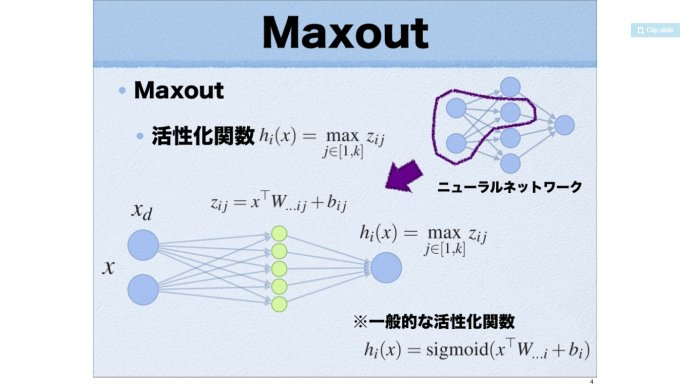

# Maxout Networks

- **Main Idea:**

  - The maxout model is simply a feed-forward architecture, such as a multilayer perceptron or deep convolutional neural network, that uses a new type of activation function.

  - A *maxout hidden layer* implements the function:
    $$
    h_i(x)=max_{j \in [1,k]}z_{ij}
    $$
    where $z_ij=x^TW_{...ij}+b_{ij}$, and $W \in R^{d \times m \times k}$ and $b \in R^{m \times k}$ are learned parameters.

    

  - A single maxout unit can be interpreted as making a piecewise linear approximation to an arbitrary convex function(Proof in the paper).

  - Unlike other activation functions, maxout activation unit does not have a fixed form and it is a self-adaptation function.

- **TensorFlow Implementation:**

```python
def maxout(inputs, num_units, axis=None):
    shape = inputs.get_shape().as_list()
    if axis is None:
        # Assume that channel is the last dimension
        axis = -1
    num_channels = shape[axis]
    if num_channels % num_units:
       raise ValueError('number of features({}) is not a multiple of num_units({})'
                        .format(num_channels, num_units))
    shape[axis] = -1
    shape += [num_channels // num_units]
    outputs = tf.reduce_max(tf.reshape(inputs, shape), -1, keep_dims=False)
    return outputs
```

​	The TF implementation is not the same as described in the paper, it does not perform the `tensordot` and `bias_add` operations, it just chooses the `max_value` of the inputs as the activated neuron.